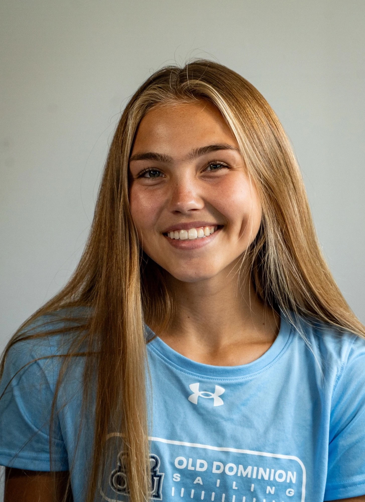
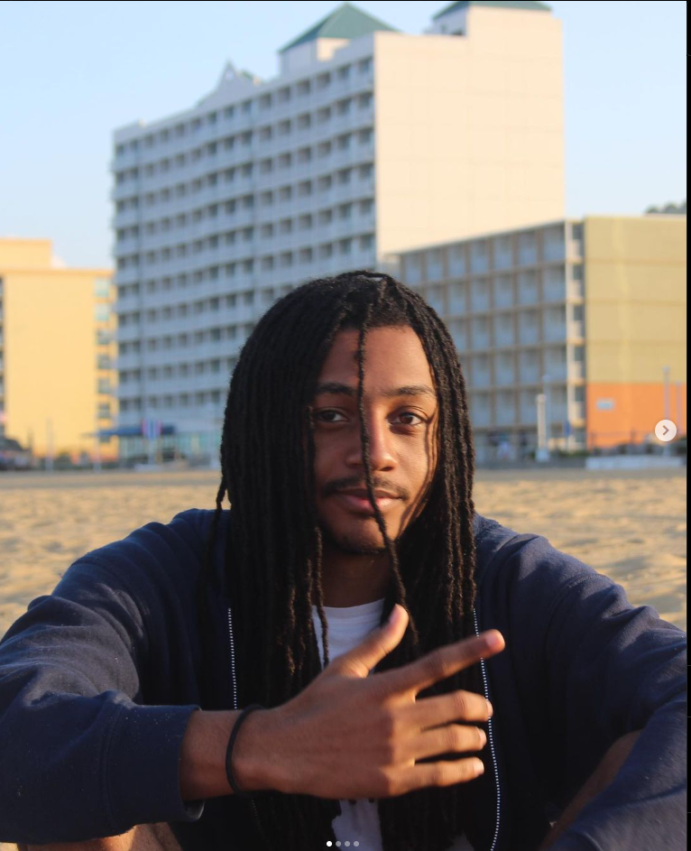

# The Team

         

        
 
                 Dan Ledwith <a href="[https://github.com/aacos007](https://github.com/dledw001)" style="font-size: 16px; margin-left: 10px;">GitHub</a>
        

        
A second degree student pursuing a bachelor’s degree in computer science. His previous degree is in 
        economics, and he currently works as a financial analyst for a registered investment advisor. His hobbies 
        include cooking and playing the guitar.
        

    

         

        
 
                 Asia Acosta <a href="https://github.com/aacos007" style="font-size: 16px; margin-left: 10px;">GitHub</a>
        

        
A third year student pursuing her BA in  Computer Science. She is a collegiate athlete; a 
            member of Old Dominion University’s sailing  team. Her hobbies consist of traveling, photography, and sports.
        

    

    

        

            Martin Salisbury <a href="https://github.com/Knulleffect" style="font-size: 16px; margin-left: 10px;">GitHub</a>
        

        
A second degree student pursuing his Masters in Computer Science. His 
        previous degree is Electrical Engineering. He is a Navy Veteran and former 
        Defense Contractor. His hobbies include traveling, hiking, cooking, and gaming.
        

    

<!---Martin Salisbury - [github](https://github.com/Knulleffect)    -->

    

        

            Diogo Silva <a href="https://github.com/dfern005" style="font-size: 16px; margin-left: 10px;">GitHub</a>
        

        
A third year student pursuing a bachelor’s degree in Computer Science. 
        He is a collegiate athlete, a member of Old Dominion University’s sailing team. 
        His hobbies include traveling, hiking, and sports. 
        

    

    

        

            Dominique Mora <a href="https://github.com/Dominique10" style="font-size: 16px; margin-left: 10px;">GitHub</a>
        

        
A senior undergraduate student pursuing a Bachelor's in Computer Science with a 
           minor in Cybersecurity. She currently works as an Aviation Maintenance Administrationman. 
           In her free time, she enjoys spending time with her family and dogs.
        

    

    

        

            Cameron Williams <a href="https://github.com/cwill104" style="font-size: 16px; margin-left: 10px;">GitHub</a>
        

        
A senior undergraduate student pursuing a Bachelor's degree in Computer Science. 
           He is a member of Old Dominion University, his hobbies include playing instruments and 
           going to the gym.
        

    

<a href="https://dledw001.github.io/BabyBites/">Return to Home</a>

